# Parcel

## and the limitations of writing tooling in JS

---
layout: intro
---

# Hi, I'm Matt 👋

## App framework bundler team @ Atlassian

@mattcompiles on Github & Twitter

---
layout: header
---

## What are gonna talk about?

::content::

- Basics of how a bundler works
- A few interesting things we do to make it fast
- How sometimes we hit the limits of what JS can do

---
layout: statement
---

## But first...

---
layout: statement
---

## Why 📦 Parcel?

---
layout: center
---

# Flash back to 2019

- Atlassian is hitting the limits of Webpack
  - Jira production builds are running for over 2 hours
- There's big ideas for features that are not supported by any open source bundlers
- Decisions is made to invest in Parcel, kicking off the Parcel V2 rewrite

---
layout: center
---

# Jumping forward to 2023

- Parcel is finally rolled out in the Jira codebase
  - Reducing production build times by around 90 minutes
- Native bundlers have become a "thing", substantially outperforming JS bundlers
  - However none with the stability or feature completness to suit our needs

---
layout: center
---

# What does a bundler do exactly?

---
layout: two-col-header
---

### Phase one

::left::

# Create the Asset graph

- Scan assets/modules for dependencies
- Resolve dependencies to assets/modules
- Run file transformations
  - Remove types
  - Convert JSX to functions
  - etc

::right::

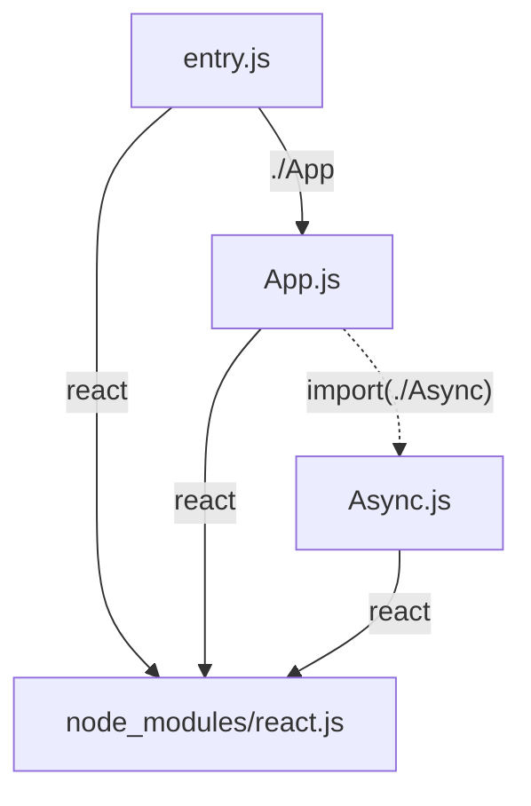

---
layout: two-col-header
---

### Phase two

::left::

# Bundling

- Create the bundle graph
- Create bundles for entry files and async imports
- Assign assets to bundles
- Split out common assets into shared bundles

::right::

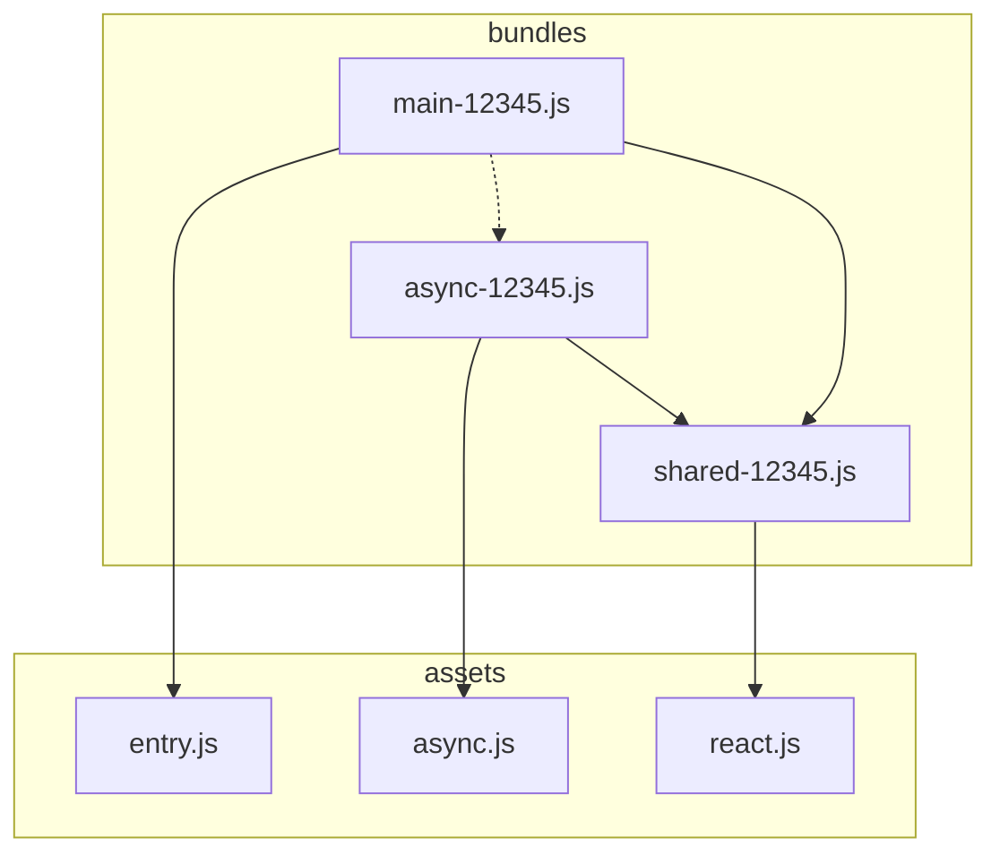

---
layout: two-col-header
---

### Phase three

::left::

# Packaging

- Render bundles and source maps to string
  - Convert assets to functions
- Run bundle level optimizations
  - Dead code removal
  - Variable name shortening
  - Whitespace removal
  - etc
- Compression
- Write bundles to disk

::right::

<span class="-mt-16 block">

```js {0|1-10|12-16|18-22|24|all}
let moduleStore = {};
let moduleCache = {};
function require(moduleId) {
  if (moduleCache[moduleId]) {
    return moduleCache[moduleId];
  }
  let result = moduleStore[moduleId]();
  moduleCache[moduleId] = result;
  return result;
}

function define(...modules) {
  for (let m of modules) {
    moduleStore[m.id] = m.fn;
  }
}

define({id: 'entry', fn: () => {
  let react = require("react");
  let app = require("app");
  react.render(react.createElement(app));
});

require('entry');

```

</span>

---
layout: two-col
---

## How do we make things fast?

::right::

<v-clicks>
  
- <span v-mark="{at: 2, type: 'strike-through'}">Do less work</span>
- <span v-mark="{at: 5, type: 'circle'}">Do the same work, but smarter</span>
- Don't repeat work you've already done
- Do multiple things at once

</v-clicks>

---
layout: two-col-header
---

## During bundling...

::left::

```js {1-2|1-4|1-4,7-9}
let assets = new Set(bundleSpecificAssets);
let bundle = createBundle(assets);

// sometime later...

// prettier-ignore
let childBundleAssets = intersection(
  new Set(bundleA.assets), bundleB.assets
);
```

::right::

```js {none|all}
function intersection(a, b) {
  for (let entry of a) {
    if (!b.has(entry)) {
      a.delete(entry);
    }
  }
  return a;
}
```

---
layout: center
---

# Sets have no built-in intersect or union methods 😲

---
layout: center
class: "text-center"
---

# But there is one JS feature that implements intersections and unions natively!

---
layout: two-col
columnClass: "text-center"
---

## Intersection = Bitwise AND

# `&`

::right::

## Union = Bitwise OR

# `|`

---
layout: header
contentClass: "text-center"
---

## BitSet

Models a set from a known list of items

::content::

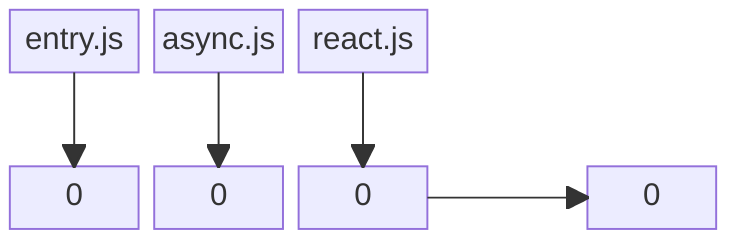

---
layout: header
contentClass: "text-center"
---

## BitSet

Models a set from a known list of items

::content::

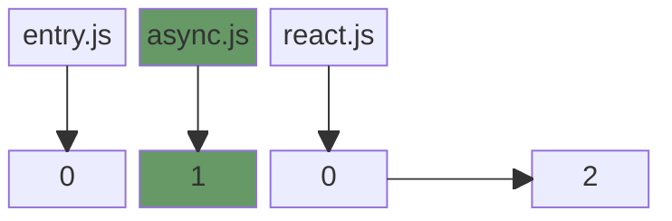

---
layout: header
contentClass: "text-center"
---

## BitSet

Models a set from a known list of items

::content::

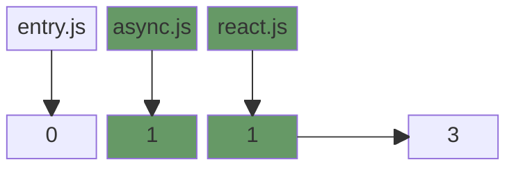

---
layout: header
contentClass: "text-center"
---

## BitSet

Models a set from a known list of items

::content::

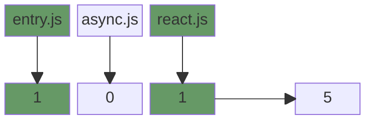

---
layout: two-col
columnClass: "text-center"
---


# &


::right::

<v-click>

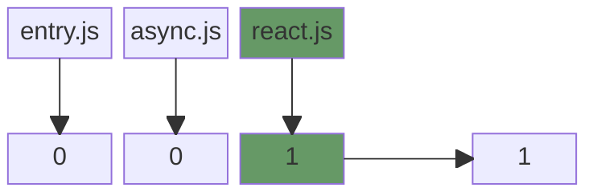

</v-click>

---
layout: center
---

# But what if you have more than 64 items in the set?

---
layout: center
---

```js {all|5|9-11,15-17|all}
export class BitSet {
  bits: Uint32Array;

  constructor(maxBits: number) {
    this.bits = new Uint32Array(Math.ceil(maxBits / 32));
  }

  intersect(other: BitSet) {
    for (let i = 0; i < this.bits.length; i++) {
      this.bits[i] &= other.bits[i];
    }
  }

  union(other: BitSet) {
    for (let i = 0; i < this.bits.length; i++) {
      this.bits[i] |= other.bits[i];
    }
  }
}
```

---
layout: center
---

```js {1-2|1-6|all}
// Create BitSet with length of all assets array
let assets = new BitSet(allAssets.length);

// Add assets using index lookup
assets.add(assetsToIndex[targetAsset]);
let bundle = createBundle(assets);

// Sometime later...

// Profit from faster intersections and unions 🙌
let childBundleAssets = BitSet.intersect(bundleA.assets, bundleB.assets);
```

---
layout: two-col
---

## How do we make things fast?

::right::

- Do the same work, but smarter
- <span v-mark="{at: 1, type: 'circle'}">Don't repeat work you've already done</span>
- Do multiple things at once

---
layout: center
class: "text-center"
---

# Caching

A computed result that can be saved for later

---
layout: two-col
---

# Caching requires

::right::

- A way to identify a piece of work
- A list of things of that could force that work to be invalidated

---
layout: two-col
---

# Requests

::right::

- Unique identifier
- Can be assigned invalidations
  - files being updating/delete/created
  - environment vars changing
  - options changing
  - etc
- Can have sub-requests or nested requests

---
layout: header
---

# Request types

::content::

|                    |                                                                  |
| ------------------ | ---------------------------------------------------------------- |
| AssetGraphRequest  | Create an AssetGraph                                             |
| AssetRequest       | Load a file, transform it and extract its symbols                |
| PathRequest        | Resolve a dependency/import to a file                            |
| BundleGraphRequest | Run bundling algorithm, tree shaking, etc. Returns a BundleGraph |
| PackageRequest     | Render a bundle to string and run optimizations on it            |
| etc                |                                                                  |

---
layout: header
contentClass: "text-center"
---

## Example

::content::

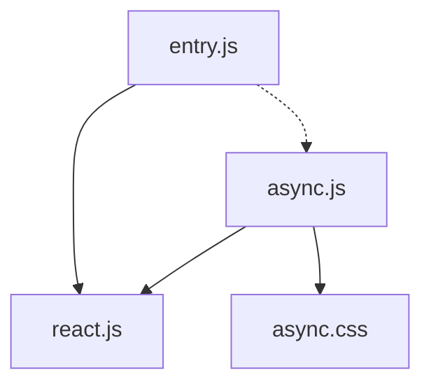

---
layout: header
---

## Requests

::content::


---
layout: header
---

## Requests

::content::

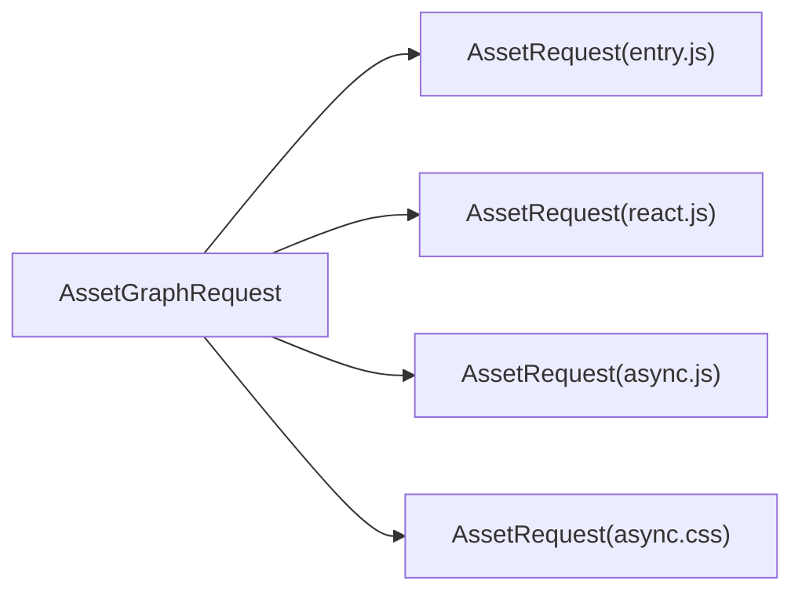

---
layout: header
---

## Requests

::content::

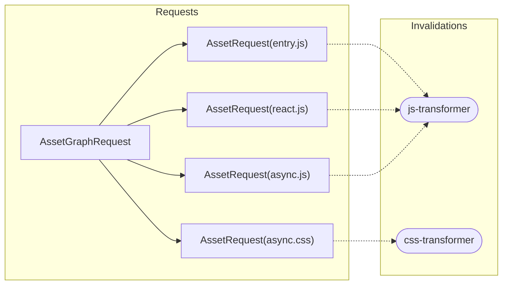

---
layout: header
---

## Requests

::content::

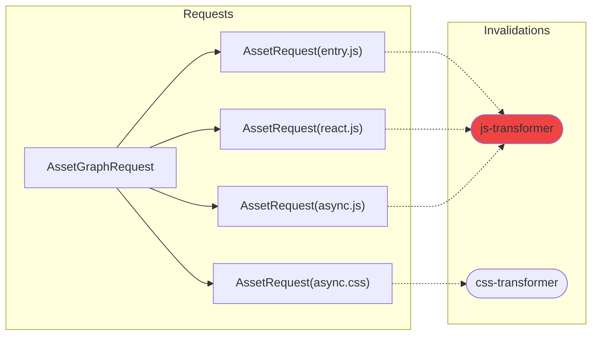

---
layout: header
---

## Requests

::content::

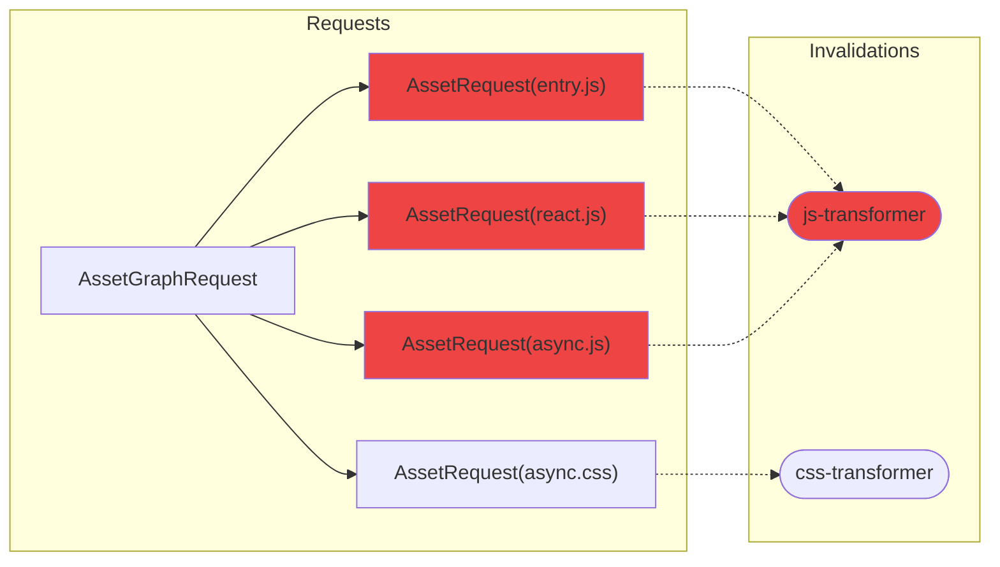

---
layout: header
---

## Requests

::content::

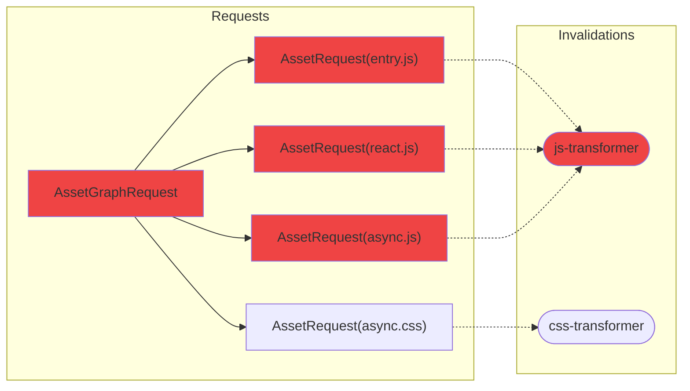

---
layout: header
contentClass: "m-auto"
---

## Code example

::content::

```js {1,11|1,11,2|1,11,3,10|1,11,3,10,4-6|1,11,3,10,4,8-9|all}
requestTracker.runRequest({
  id: hash(filePath, targetEnvironment),
  run: (api) => {
    // assign invalidations
    api.invalidateOnFileChange(transformerFilePath);
    api.invalidateOnEnvChange("NODE_ENV");

    // run sub-request, could be cached
    let subResult = api.runRequest(createSubrequest());
  },
});
```

---
layout: two-col
---

# What about persistence?

::right::

```js {none|1-4,16|1-4,16,5-9|1-4,16,11-16|all}
import v8 from "v8";
import fs from "fs/promises";

class RequestTracker {
  async writeToCache() {
    let buffer = v8.serialize(this.graph);

    await fs.writeFile("da-cache", buffer);
  }

  static async readFromCache() {
    let buffer = await fs.readFile("da-cache");
    let graph = v8.deserialize(buffer);

    return new RequestTracker(graph);
  }
}
```

---
layout: center
---

# Serialization can be slow on large apps 🤔

---
layout: image
image: "./thinking.jpeg"
backgroundPosition: "left"
class: "flex items-center text-center"
---

# What if we cache the cache write?

---
layout: header
contentClass: "text-center"
---

# Incremental cache writing

::content::

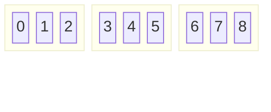

---
layout: header
contentClass: "text-center"
---

# Incremental cache writing

::content::

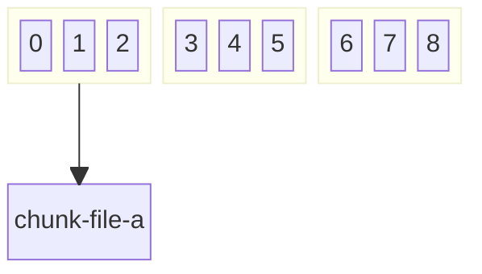

---
layout: header
contentClass: "text-center"
---

# Incremental cache writing

::content::

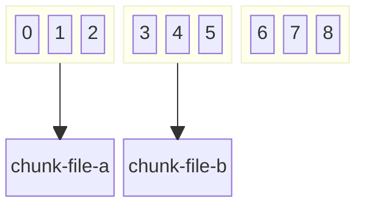

---
layout: header
contentClass: "text-center"
---

# Incremental cache writing

::content::

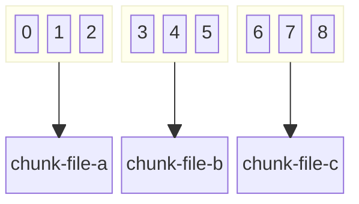

---
layout: header
contentClass: "text-center"
---

# Incremental cache writing

::content::

```mermaid
block-beta
columns 3
block:nodesA
columns 3
0 1 2
end
block:nodesB
columns 3
3 4 5
end
block:nodesC
columns 3
6 7 8
end
space:3
a["chunk-file-a"]
b["chunk-file-b"]
c["chunk-file-c"]

nodesA --> a
nodesB --> b
nodesC --> c

classDef check stroke:#facc15;
class nodesA check
```

---
layout: header
contentClass: "text-center"
---

# Incremental cache writing

::content::

```mermaid
block-beta
columns 3
block:nodesA
columns 3
0 1 2
end
block:nodesB
columns 3
3 4 5
end
block:nodesC
columns 3
6 7 8
end
space:3
a["chunk-file-a"]
b["chunk-file-b"]
c["chunk-file-c"]

nodesA --> a
nodesB --> b
nodesC --> c

classDef check stroke:#facc15;
classDef valid stroke:#22c55e;
class nodesA valid
class nodesB check
```

---
layout: header
contentClass: "text-center"
---

# Incremental cache writing

::content::

```mermaid
block-beta
columns 3
block:nodesA
columns 3
0 1 2
end
block:nodesB
columns 3
3 4 5
end
block:nodesC
columns 3
6 7 8
end
space:3
a["chunk-file-a"]
b["chunk-file-b"]
c["chunk-file-c"]

nodesA --> a
nodesB --> b
nodesC --> c

classDef check stroke:#facc15;
classDef valid stroke:#22c55e;
class nodesA,nodesB valid
class nodesC check
```

---
layout: header
contentClass: "text-center"
---

# Incremental cache writing

::content::

```mermaid
block-beta
columns 3
block:nodesA
columns 3
0 1 2
end
block:nodesB
columns 3
3 4 5
end
block:nodesC
columns 3
6 7 8
end
space:3
a["chunk-file-a"]
b["chunk-file-b"]
c["chunk-file-c"]

nodesA --> a
nodesB --> b
nodesC --> c

classDef check stroke:#facc15;
classDef valid stroke:#22c55e;
class nodesA,nodesB,nodesC valid
```

---
layout: header
contentClass: "text-center"
---

# Incremental cache writing

::content::

```mermaid
block-beta
columns 3
block:nodesA
columns 3
0 1 2
end
block:nodesB
columns 3
3 4 5
end
block:nodesC
columns 3
6 7 8
end
space:3
a["chunk-file-a"]
space
c["chunk-file-c"]

nodesA --> a
nodesC --> c

classDef check stroke:#facc15;
classDef valid stroke:#22c55e;
classDef invalid stroke:#ef4444;
class 5 invalid
```

---
layout: header
contentClass: "text-center"
---

# Incremental cache writing

::content::

```mermaid
block-beta
columns 3
block:nodesA
columns 3
0 1 2
end
block:nodesB
columns 3
3 4 5
end
block:nodesC
columns 3
6 7 8
end
space:3
a["chunk-file-a"]
space
c["chunk-file-c"]

nodesA --> a
nodesC --> c

classDef check stroke:#facc15;
classDef valid stroke:#22c55e;
classDef invalid stroke:#ef4444;
class 5 invalid
class nodesA check
```

---
layout: header
contentClass: "text-center"
---

# Incremental cache writing

::content::

```mermaid
block-beta
columns 3
block:nodesA
columns 3
0 1 2
end
block:nodesB
columns 3
3 4 5
end
block:nodesC
columns 3
6 7 8
end
space:3
a["chunk-file-a"]
space
c["chunk-file-c"]

nodesA --> a
nodesC --> c

classDef check stroke:#facc15;
classDef valid stroke:#22c55e;
classDef invalid stroke:#ef4444;
class 5 invalid
class nodesA valid
class nodesB check
```

---
layout: header
contentClass: "text-center"
---

# Incremental cache writing

::content::

```mermaid
block-beta
columns 3
block:nodesA
columns 3
0 1 2
end
block:nodesB
columns 3
3 4 5
end
block:nodesC
columns 3
6 7 8
end
space:3
a["chunk-file-a"]
b["chunk-file-b"]
c["chunk-file-c"]

nodesA --> a
nodesB --> b
nodesC --> c

classDef check stroke:#facc15;
classDef valid stroke:#22c55e;
classDef invalid stroke:#ef4444;
class nodesA,nodesB valid
```

---
layout: header
contentClass: "text-center"
---

# Incremental cache writing

::content::

```mermaid
block-beta
columns 3
block:nodesA
columns 3
0 1 2
end
block:nodesB
columns 3
3 4 5
end
block:nodesC
columns 3
6 7 8
end
space:3
a["chunk-file-a"]
b["chunk-file-b"]
c["chunk-file-c"]

nodesA --> a
nodesB --> b
nodesC --> c

classDef check stroke:#facc15;
classDef valid stroke:#22c55e;
classDef invalid stroke:#ef4444;
class nodesA,nodesB valid
class nodesC check
```

---
layout: header
contentClass: "text-center"
---

# Incremental cache writing

::content::

```mermaid
block-beta
columns 3
block:nodesA
columns 3
0 1 2
end
block:nodesB
columns 3
3 4 5
end
block:nodesC
columns 3
6 7 8
end
space:3
a["chunk-file-a"]
b["chunk-file-b"]
c["chunk-file-c"]

nodesA --> a
nodesB --> b
nodesC --> c

classDef check stroke:#facc15;
classDef valid stroke:#22c55e;
classDef invalid stroke:#ef4444;
class nodesA,nodesB,nodesC valid
```

---
layout: two-col
---

## How do we make things fast?

::right::

- Do the same work, but smarter
- Don't repeat work you've already done
- <span v-mark="{at: 1, type: 'circle'}">Do multiple things at once</span>

---
layout: two-col
---

## Opportunties for concurrency

::right::

- Asset transformation
- Bundle packaging

---
layout: two-col
---

## `@parcel/workers`

::right::

- Can use different worker backends
  - node worker threads
  - processes
  - browser web workers
- Can spawn workers based on machine capability (CPU count)
- Attempts to distribute work evenly between workers
- Handles serialization/deserialization of parameters

---
layout: two-col
---

```js {all|4-6|8|all}{at:1}
import WorkerFarm from "@parcel/workers";

async function run() {
  let farm = new WorkerFarm({
    workerPath: require.resolve("./worker.js"),
  });

  let handle = farm.createHandle("runTransform");
  let result = await handle("entry.js");
}
```

::right::

```js {all|1|2|all}{at:1}
// worker.js
export async function runTransform(filePath) {
  // Do CPU intensive work...

  return result;
}
```

---
layout: center
---

# Serialization is slow!

---
layout: center
---

```js
async function run() {
  // Packaging needs access to the graphs
  let handle = farm.createHandle("runPackaging");

  // This will take a while
  let result = await handle(bigAssGraphs);
}
```

---
layout: center
class: "text-center"
---

# JS can't share memory with other threads

Or can it?

---
layout: two-col
---

# SharedArrayBuffer

::right::

<v-clicks>

- Allows memory sharing between JS worker threads 🙌
- Data is limited to a typed array buffers 🥲
  - Arrays of numbers for the normies
- So pretty useless then... 🤷

</v-clicks>

---
layout: center
class: "text-center"
---

# What does a graph structure actually look like?

---
layout: two-col-header
columnClass: "text-center"
---

## AdjacencyList

::left::

```mermaid
flowchart TB
entry.js --> react.js
entry.js --> async.js
async.js --> react.js
```

::right::

```mermaid
block-beta
columns 3
block
  columns 1
  nodes entry async react
end
space
block
  columns 1
  edges
  block:entryedges
    columns 2
    a["async"] b["react"]
  end
  block:asyncedges
    columns 2
    e["react"] space
  end
  block:reactedges
    columns 2
    space:2
  end
end

entry --> entryedges
async --> asyncedges
react --> reactedges

style nodes stroke:none,fill:none;
style edges stroke:none,fill:none;
```

---
layout: two-col-header
columnClass: "text-center"
---

## AdjacencyList

::left::

```mermaid
flowchart TB
entry.js["entry.js (0)"] --> react.js["react.js (2)"]
entry.js["entry.js (0)"] --> async.js["async.js (1)"]
async.js["async.js (1)"] --> react.js["react.js (2)"]
```

::right::

```mermaid
block-beta
columns 3
block
  columns 1
  nodes 0 1 2
end
space
block
  columns 1
  edges
  block:entryedges
    columns 2
    a["1"] b["2"]
  end
  block:asyncedges
    columns 2
    e["2"] space
  end
  block:reactedges
    columns 2
    space:2
  end
end

0 --> entryedges
1 --> asyncedges
2 --> reactedges

style nodes stroke:none,fill:none;
style edges stroke:none,fill:none;
```

---
layout: two-col-header
---

## `@parcel/graph`

::left::

<v-clicks>

- An AdjacencyList backed by SharedArrayBuffer and UInt32Array
- It does this via a bespoke hash map and double linked list implementation
- Node data is still stored as standard JS objects
- Big improvement to worker call times and cache serialization times 🎉
- Backs the RequestGraph, AssetGraph and BundleGraph

</v-clicks>

::right::

```js {hide|all}
import Graph from "@parcel/graph";

let graph = new Graph();

let entryNodeId = graph.addNode({ id: "entry" });
let reactNodeId = graph.addNode({ id: "react" });

graph.addEdge(entryNodeId, reactNodeId);
```

---
layout: two-col
---

## How do we make things fast?

::right::

- <span v-mark="{at: 1, type: 'strike-through'}">Do the same work, but smarter</span>
- <span v-mark="{at: 1, type: 'strike-through'}">Don't repeat work you've already done</span>
- <span v-mark="{at: 1, type: 'strike-through'}">Do multiple things at once</span>

<v-click>

- Don't do it in JavaScript

</v-click>

---
layout: iframe-right
url: "https://napi.rs/"
scale: 0.75
---

# NAPI

- Allows you to call from JS into Rust easily
- Generates the JS binding code for
  - including types!

---
layout: two-col-header
---

# `@parcel/rust`

::left::

- Package of JS bindings for all our Rust code
- Currently handles
  - Content hashing
  - File/dependency resolver
  - JS transformation and symbol extraction via SWC
  - Image optimization

::right::

```js
import { transformAsync } from "@parcel/rust";

// Let's let Rust handle this
let result = transformAsync({ filename: "entry.js" });
```

---
layout: center
---

# So what's next?

---
layout: image
image: "./drake.jpeg"
backgroundSize: "center"
class: "text-center flex items-center"
---

## I'll just leave you with this

---
layout: center
---

# Thanks for listening to me ramble

## Questions?
