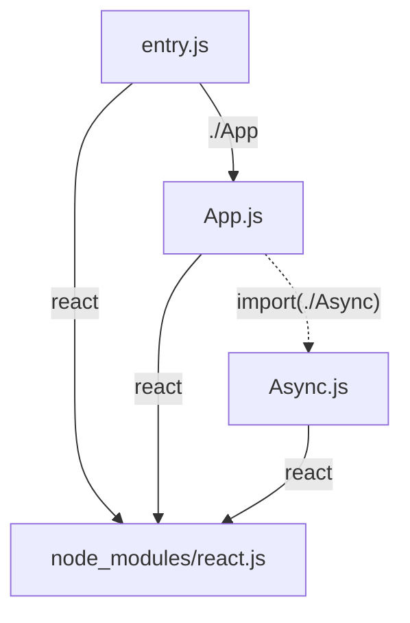
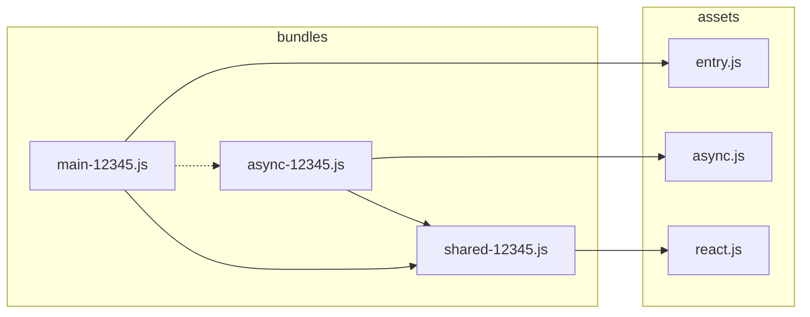

# Parcel

## and the limitations of writing tooling in JS

---
layout: intro
---

# Hi, I'm Matt 👋

## Work on Parcel in the App framework bundler team @ Atlassian

@mattcompiles

---

- Basics of how a bundler works
- Some techniques we use to make it fast
- How sometimes we hit the limits of what JS can do

---
layout: statement
---

## But first...

---
layout: statement
---

## Why Parcel?

---
layout: center
---

# Flash back to 2022

- Atlassian is hitting the limits of Webpack
- Jira production builds are running for over 2 hours
- There's big ideas for features that are not supported by any open source bundlers
- Decisions is made to invest in Parcel, kicking off the Parcel V2 rewrite

---

<div class="grid grid-cols-2 gap-4 items-center h-full">
<div>
    
## Jira is big

</div>

<div>

- TODO: Number of files in Jira
- TODO: number of bundles in Jira
- TODO: Size in bytes

</div>
</div>

---
layout: center
---

# What does a bundler do exactly?

---
layout: two-col-header
---

### Phase one

::left::

# Create the Asset graph

- Scan assets/modules for dependencies
- Resolve dependencies to assets/modules
- Run file transformations
  - Remove types
  - Convert JSX to functions
  - etc

::right::



---
layout: two-col-header
---

### Phase two

::left::

# Bundling

- Create the bundle graph
- Create bundles for entry files and async imports
- Assign assets to bundles
- Split out common assets into shared bundles

::right::



---
layout: two-col-header
---

### Phase three

::left::

# Packaging

- Render bundles and source maps to string
  - Convert assets to functions
- Run bundle level optimizations
  - Dead code removal
  - Variable name shortening
  - Whitespace removal
  - etc
- Compression
- Write bundles to disk

::right::

```js {0|1-10|12-16|18-22|24|all}
let moduleStore = {};
let moduleCache = {};
function require(moduleId) {
  if (moduleCache[moduleId]) {
    return moduleCache[moduleId];
  }
  let result = moduleStore[moduleId]();
  moduleCache[moduleId] = result;
  return result;
}

function define(...modules) {
  for (let m of modules) {
    moduleStore[m.id] = m.fn;
  }
}

define({id: 'entry', fn: () => {
  let react = require("react");
  let app = require("app");
  react.render(react.createElement(app));
});

require('entry');
```

---
layout: two-col
---

## How do we make things fast?

::right::

<v-clicks>
  
- <span v-mark.line-through>Do less work</span>
- Do the same work, but smarter
- Don't repeat work you've already done
- Do multiple things at once

</v-clicks>
